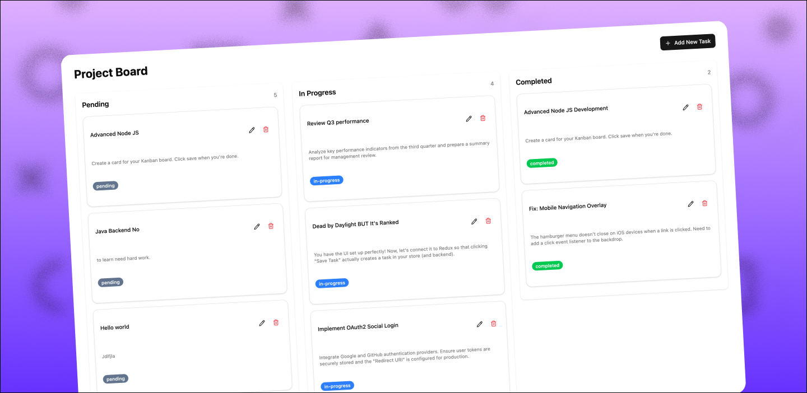
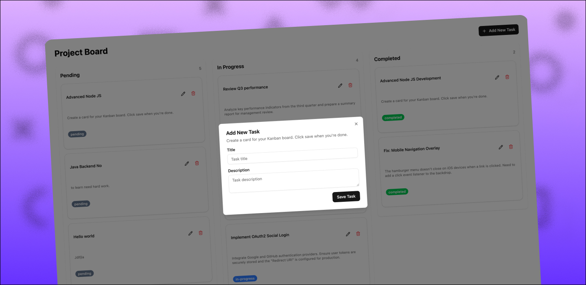
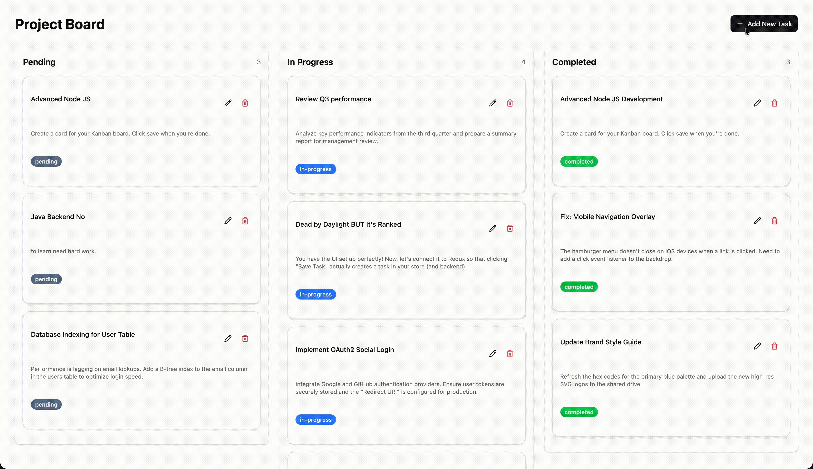

# Kanban-Lite


## Description

Kanban-Lite is a lightweight, single-page Kanban board application for managing tasks across columns. It provides a minimal, developer-friendly stack (Vite + React) with a small Express backend to store tasks, intended for developers who want an easy-to-run local kanban board or a starter template for projects.

## Features

- Create, update, and delete tasks
- Drag-and-drop task cards across columns (To Do, In Progress, Done)
- Persistent storage via a simple backend API
- Responsive UI components and accessible inputs
- Lightweight and easy to extend for custom workflows

## Technology stack

- Frontend: React, Vite, JSX, Tailwind / CSS (project-specific)
- State management: built-in React state / Redux Toolkit (features/taskSlice.js)
- Backend: Node.js, Express
- Database: (configurable) — e.g., MongoDB or any REST-backed store

## Screenshots

### Main Board View
<p align="center">
  
</p>
<p align="center"><i>Main Kanban board showing columns and task cards</i></p>

### Task Creation
<p align="center">
  
</p>
<p align="center"><i>Create task dialog for adding new tasks</i></p>

### Drag and Drop Demo
<p align="center">
  
</p>
<p align="center"><i>Dragging tasks between columns</i></p>

## Installation

Prerequisites:

- Node.js (v16+ recommended)
- npm or yarn

Steps:

1. Clone the repository

```bash
git clone <your-repo-url>
cd Kanban-Lite
```

2. Install backend dependencies and start the API server

```bash
cd backend
npm install
npm run dev
# (uses `nodemon server.js` as configured in backend/package.json)
```

3. Install frontend dependencies and start the development server

```bash
cd ../frontend
npm install
npm run dev
```

The frontend will typically be served at `http://localhost:5173` (Vite default) and the backend at `http://localhost:3000` (common Express dev port). Run the frontend and backend in separate terminals:

```bash
# Terminal 1 - backend
cd backend && npm run dev

# Terminal 2 - frontend
cd frontend && npm run dev
```

If you prefer a single command, consider installing `concurrently` or adding a top-level npm script to run both services together.

## Usage

- Open the frontend URL in your browser.
- Use the "Create" button to add tasks with title, description, and optional metadata.
- Drag tasks between columns to update status. Tasks are saved to the backend.
- Use the task card menu to edit or delete tasks.

Example API interactions (replace host/port as configured):

```bash
# Fetch tasks
curl http://localhost:3000/api/tasks

# Create task
curl -X POST http://localhost:3000/api/tasks -H "Content-Type: application/json" -d '{"title":"New Task","column":"todo"}'
```

## Configuration

Common environment variables (adjust names according to your setup):

- `PORT` — backend server port (default: `3000`)
- `MONGODB_URI` or `DATABASE_URL` — connection string for persistent storage
- `VITE_API_URL` — frontend build/dev API base URL (e.g., `http://localhost:3000`)

Add a `.env` file in the `backend` folder for the backend variables and in the `frontend` folder for any Vite-specific variables.

## Acknowledgments

- Built with Vite and React — thanks to the Vite and React communities
- Uses inspiration and patterns from small kanban starter projects and tutorials
- UI utilities and components (if applicable) — credit any specific libraries used in `frontend/package.json`


## License

This project is provided as-is. Add a `LICENSE` file to declare a license (e.g., MIT).